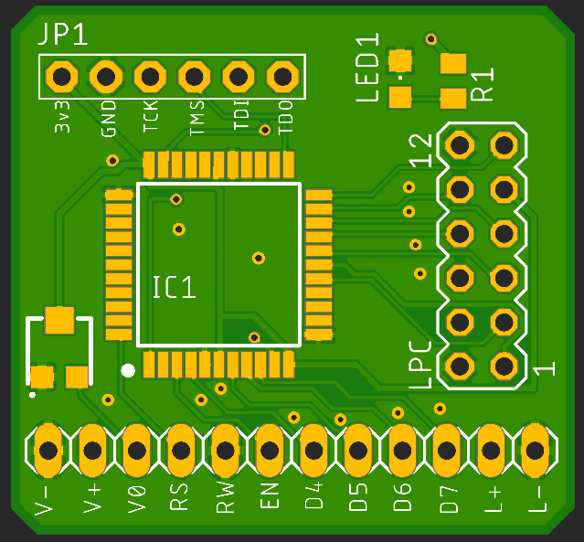
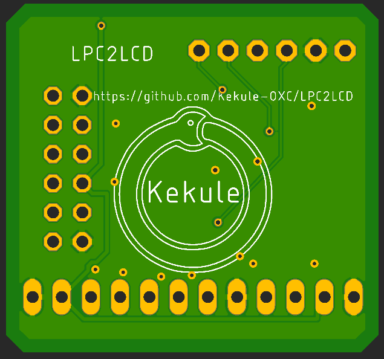


# LPC2LCD

This is a custom board that implements the [AladdinLPC](https://github.com/Ryzee119/AladdinLCD) code written by Ryzee119 Ideally. gerbers are available [here](eagle/LPC2LCD_v1_gerbers.zip)

This VHDL was writtenby Ryzee119 to replace the CPLD logic on the cheap AladdinXT 4032 Original Xbox modchip.  This is best used with a TSOP flashed console. Soft modded functionality unverified.

The Lattice LC4032V CPLD  is extremely limited, so this is a bare minimum to reduce macro-cell usage to fit onto the CPLD. Therefore it will not support any other functionality.

-   This does not support adjusting the backlight via the dashboard settings.
-   This has very limited contrast control through the dashboard settings. It couldn't even manage an 8-bit PWM signal. For the dashboard settings:  **0%=No Contrast up to 25%=Full Constrast**.  For best results set the contrast to `25%` in the dashboard and use the on board trim pot to set the desired contrast.

# Instructions

1.  Connect a JTAG programmer to the JTAG pins.
    
2.  Make sure to apply 3.3V power to the LPC2PCB board. This can be done by plugging it into the LPC port on the Xbox, an external power supply, or a JTAG programmer that can supply power.  A modified Lattice USB programmer or FlashCat are two examples of programmers that can supply power.
    
3.  Program the CPLD with the  `SVF`  file in this repository . It can be programmed with  [UrJTAG](http://urjtag.org/)  using a  [compatible programming cable](http://urjtag.org/book/_system_requirements.html#_supported_jtag_adapters_cables). The general programming sequence in UrJTAG is something like: (Commands written in  **bold**).
    
    **cable usbblaster**  _Type  `help cable`  for other supported cables._  
    **detect**  _To confirm that the cpld is detected._  
    **svf LPC2LCD.SVF progress**  _To program the CPLD._
        
4.  Remove the JTAG programming points.
    
5.  Remove the flash memory and socket from the Aladdin Chip to expose the required usable IO pads. Be careful not too damage the pads.
    
6.  Wire the LCD as per the diagram below.
    
7.  Install onto the LPC header in your Xbox. There is no other connections to worry about.  _If you have a 1.6 motherboard you will need to rebuild the LPC as you would for a modchip install.  **Don't**  ground any D0 points etc._
    
8.  Enable  `SmartXX`  LCD in your dashboard.
    
9.  Set contrast to `25%`  to max out the contrast. Use the trim pot on the top of the board to set the desired contrast

